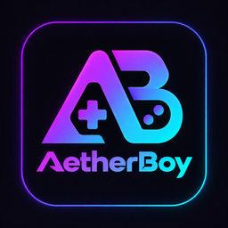
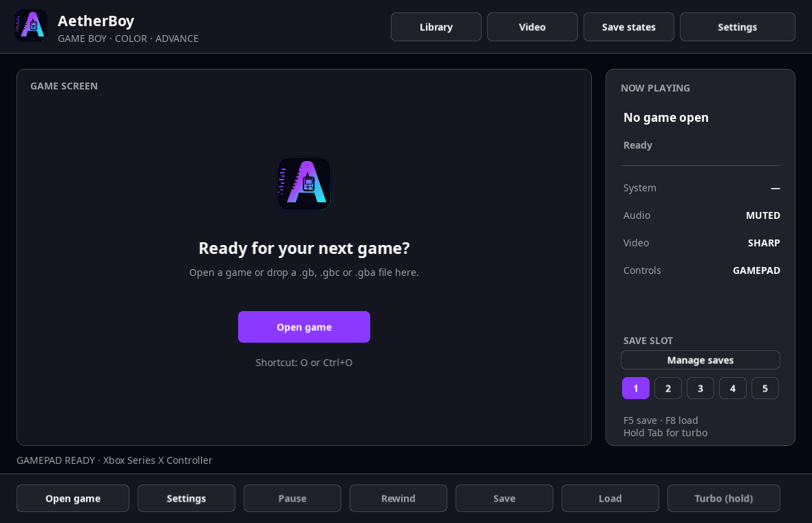
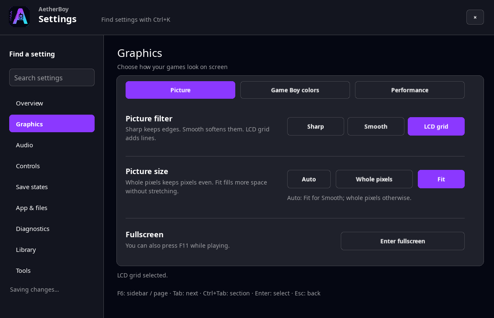

<p align="center">
  
</p>

<h1 align="center">AetherBoy</h1>

<p align="center"><strong>by NekoZDevTeam</strong></p>

Windows ↔ Linux: shared turbo-audio, screenshot and performance services, plus
custom Windows menus. [Delivered changes and remaining parity work (DE/EN)](docs/PLATFORM_PARITY.md).
Full 1:1 feature parity is still in progress.

New on Windows: Firmware Station for user-provided boot ROMs/BIOS and configurable,
bounded local diagnostics. [Usage, privacy and developer handoff (DE/EN)](docs/WINDOWS_FIRMWARE_DIAGNOSTICS.md).

Experimental Windows Local Link Lab: run two GB/GBC or two GBA games in one coordinated
local session, with separate player saves. This lab is local-only and has no verified
commercial-game support yet; Linux local-link UI integration is pending.
[Quick start, limitations and Linux handoff (DE/EN)](docs/LOCAL_LINK_LAB.md).
[GBA serial/CPU integration](docs/GBA_LOCAL_LINK_HANDOFF.md) ·
[Latest Linux contribution and integration review](docs/LINUX_UPSTREAM_INTEGRATION_REVIEW.md).

New, separate **GB/GBC Online Link prototype** for Windows and Linux: one local game
per player, private session saves and a browser-assisted encrypted WebRTC connection.
No verified Pokémon trade yet; Internet traversal may require
explicit STUN/TURN configuration. [Setup, safety and limits (DE/EN)](docs/ONLINE_LINK_HANDOFF.md).

New **GBA Pokémon Gen3 online development profile** uses the same Windows/Linux
transport with an original game-protocol adapter. Exact identified original builds
only, explicit development consent, no verified trading release or generic GBA WAN
support. Both frontends can review journaled session saves and explicitly adopt a
clean copy with a retained backup. [GBA setup, save safety and acceptance gates (DE/EN)](docs/GBA_ONLINE_HANDOFF.md).

Windows development update: stereo/WASAPI, GPU presentation, state gallery and resume,
controller Quick Deck, per-game profiles and IPS/BPS/UPS Patch Lab.
[What's changed, usage and Linux developer handoff (DE/EN)](docs/WINDOWS_DEVELOPMENT_HANDOFF.md#english).

Linux follow-up: central saves, stereo, state gallery/resume/undo, per-game settings,
favorites/playtime, controller profiles and Patch Lab.
[Linux integration handoff for the Windows developer / next ChatGPT](docs/LINUX_DEVELOPMENT_HANDOFF.md).

<p align="center">
  <strong lang="en">English</strong> · <a href="README_DE.md" lang="de">Deutsch</a>
</p>

<p align="center">
  <strong>Three handhelds. One interface.</strong><br>
  Game Boy · Game Boy Color · Game Boy Advance<br>
  A C# emulator for Windows and native Linux / Wayland.
</p>

<p align="center">
  <a href="CHANGELOG.md"></a>
  <a href=".github/workflows/ci.yml"></a>
  <a href="global.json"></a>
  <a href="docs/LINUX_USER_GUIDE.md"></a>
  <a href="LICENSE"></a>
</p>

<p align="center">
  <a href="#linux-build">Linux build</a> ·
  <a href="#windows-build">Windows build</a> ·
  <a href="#linux-controls">Controls</a> ·
  <a href="COMPATIBILITY.md">Compatibility</a> ·
  <a href="#documentation">Documentation</a> ·
  <a href="https://github.com/VoltexModz/AetherBoy/issues">Issues</a>
</p>

> [!IMPORTANT]
> **AetherBoy is an alpha release.** GB and GBC have broad automated test coverage. GBA and the Linux frontend are experimental and need further gameplay, audio and long-term testing. Successfully starting a ROM does not establish full playability.

## A look at AetherBoy

The **Aether Wave interface** brings together the game display, a live session sidebar, quick actions and a central Control Center. Violet, cyan and dark surfaces define the shared design on Windows and Linux.

<p align="center">
  
  <br>
  <sub>Actual screenshot of the native Linux frontend, with no ROM loaded. The captured interface includes German text.</sub>
</p>

<details>
<summary><strong>View the Control Center</strong></summary>

<p align="center">
  
</p>

Nine sections cover overview, display, audio, input, saves, system and diagnostics. This screenshot shows the Linux client's display settings.

</details>

## Features

| Area | Features |
| --- | --- |
| **Three systems** | `.gb`, `.gbc` and experimental `.gba` support in the same frontend; GBA with an optional BIOS and a built-in HLE fallback. |
| **Video and audio** | Sharp, Smooth and LCD Grid filters, DMG palettes, frameskip and audio output; GBA with PSG and Direct Sound. |
| **Gameplay controls** | Keyboard and gamepad input, pause, turbo, fullscreen and ROM drag-and-drop. |
| **Saves and rewind** | Battery saves, five save-state slots and rewind for GB, GBC and GBA. |
| **Save protection** | Atomic `.sav` writes, integrity checks and three rotating backups. |
| **Local preferences** | Persistent display, audio and input settings in the Control Center. |

### Windows and Linux compared

Both frontends share the same platform-neutral Core and Runtime. The available desktop tools still differ:

| | Windows | Linux |
| --- | --- | --- |
| **Frontend** | Windows Forms | SDL3, native Wayland |
| **Aether interface and Control Center** | Available | Available, adapting to tiled and wide windows |
| **Open ROM** | File dialog and drag-and-drop | XDG Desktop Portal, file path and drag-and-drop |
| **Keyboard / gamepad** | Both, with remapping settings | Both; keyboard and controller profiles, remapping and deadzone |
| **Battery saves, five state slots, rewind** | Available | Available |
| **Cartridge Vault, cheat management, Save Safety Center** | Available, partly experimental | Linux library, session cheats and backup recovery available |
| **WAV recording and boot ROM selection** | Available | Available under Tools / System |
| **State gallery/resume and per-game profiles** | Available | Available, including undo after state load |
| **Quick Deck** | Available | Separate frontend follow-up |
| **Native screenshots / performance overlay** | Available | F12 / F9 and Tools, shared services |
| **IPS / BPS / UPS Patch Lab** | Integrated; UPS undo is explicit | Available under Library → Patch Lab; explicit UPS undo |
| **Stereo playback** | GB/GBC/GBA end-to-end | GB/GBC/GBA end-to-end |
| **Local GB/GBC/GBA link** | Experimental two-player Local Link Lab; same hardware family only, no commercial-game validation yet | Shared Core/Runtime available; native UI pending |

See [Windows → Linux: UI status](docs/LINUX_UI_PARITY.md) for the detailed mapping.

## Linux build

**New: a dedicated native Linux client using SDL3 and Wayland**, including a Hyprland profile, audio, gamepads, the Control Center and application menu installation. The build scripts automatically detect **x86-64** and **ARM64**.

### Requirements

- Linux with a **native Wayland session** and a working graphics driver.
- **.NET SDK 10.0.302** or a newer patch within the same `10.0.3xx` feature band, as specified in [`global.json`](global.json).
- The standard .NET system dependencies, including ICU, plus PipeWire, PulseAudio or ALSA client libraries for audio.
- A suitable **XDG Desktop Portal** for the file dialog. On Hyprland, use `xdg-desktop-portal-hyprland` plus a GTK or KDE portal for file selection.

SDL3, the logo and fonts are supplied through the project. The Linux client requires native Wayland; **X11 and XWayland are not supported**. Hyprland, KDE Plasma and GNOME are detected separately.

### Build and launch

The current development version is on the `development` branch:

```bash
git clone --branch development https://github.com/VoltexModz/AetherBoy.git
cd AetherBoy
bash scripts/build-linux.sh
bash scripts/run-linux.sh
```

Then open a `.gb`, `.gbc` or `.gba` file using **OPEN ROM**, the **O** key or drag-and-drop. Extract archives first. You can also pass a ROM path directly:

```bash
bash scripts/run-linux.sh "/path/to/your-game.gba"
```

| Architecture | Build output |
| --- | --- |
| x86-64 | `artifacts/AetherBoy-linux-x64/` |
| ARM64 | `artifacts/AetherBoy-linux-arm64/` |

The default build requires an installed **.NET 10 runtime** to run. For archives with an embedded runtime, see [Linux distribution](docs/LINUX_DISTRIBUTION.md). The SDK already includes it. `run-linux.sh` rebuilds automatically when the build is missing or older than the source files.

### Install in the application menu

After building, you can install AetherBoy for the current user without root privileges:

```bash
bash scripts/install-linux-user.sh
aetherboy "/path/to/your-game.gbc"
```

Program files default to `~/.local/share/aetherboy/program`, with the launcher at `~/.local/bin/aetherboy`. The script also installs the desktop entry and icons. To launch from a terminal, `~/.local/bin` must be on your `PATH`. The installed launcher also finds the runtime recorded during installation, without requiring an interactive shell PATH. Updates prepare a new release before activation.

<details>
<summary><strong>Check Wayland and troubleshoot startup</strong></summary>

```bash
echo "$XDG_SESSION_TYPE"
echo "$WAYLAND_DISPLAY"
dotnet --version
```

`WAYLAND_DISPLAY` must be set; a session reported as `x11` is rejected.

Check desktop detection without opening a window:

```bash
dotnet run --project frontends/AetherBoy.Desktop/AetherBoy.Desktop.csproj -- --platform-info
```

Check Wayland and the default audio device together:

```bash
bash scripts/run-linux.sh --audio-info
```

If the file dialog does not appear on Hyprland, check the [portal configuration](docs/LINUX_USER_GUIDE.md#6-hyprland-setup). For more help, see [Linux troubleshooting](docs/LINUX_USER_GUIDE.md#7-troubleshooting).

</details>

**Read more:** [Linux User Guide (English)](docs/LINUX_USER_GUIDE.md) · [Linux / Wayland / Hyprland (German)](docs/LINUX_WAYLAND.md)

## Windows build

Requires Windows and the same **.NET SDK 10.0.302**, or a newer patch within the `10.0.3xx` feature band. Audio output requires a working Windows WinMM device.

Run these commands in PowerShell from the repository directory:

```powershell
dotnet restore ./nanoboy.sln --locked-mode --configfile ./NuGet.config
dotnet build ./nanoboy.sln -c Release --no-restore
dotnet run --project ./nanoboy/nanoboy.csproj -c Release --no-build
```

### Windows local storage and development diagnostics

The normal application defaults to the development channel, including `-c Release`
builds. It records local sessions automatically; no separate tester application or
startup switch is required. The channel is embedded in the EXE and needs no Git
installation on the player's PC. Future stable releases can use
`-p:AetherBoyChannel=stable` when building/publishing to disable automatic session
recording. The optional `--tester-mode` switch remains supported for diagnostics.

Managed Windows data lives under `%LOCALAPPDATA%\AetherBoy`:

| Directory | Contents |
| --- | --- |
| `Roms/<SHA-256>/` | Imported ROM copies with readable filenames |
| `Saves/<SHA-256>/` | `game.sav`, RTC, integrity files and rotating backups |
| `States/<SHA-256>/` | `game.ss1`–`game.ss5`, `game.resume`, previews and previous-state backups |
| `Settings/` | `settings.json`, backup, recent ROM history and `Profiles/<SHA-256>.json` |
| `Library/` | Per-ROM title, favorites, playtime and preview metadata |
| `Screenshots/<SHA-256>/` | Manually captured native-resolution gameplay PNGs |
| `Firmware/` | Optional user-supplied boot ROMs/BIOS |
| `Recordings/` | Default destination for manually saved WAV recordings |
| `development/Sessions/` | Diagnostic session reports |
| `development/Crashes/` | Development crash logs |

The library provides **ROM-Ordner öffnen** (open ROM folder); **Control Center →
Ordner** opens all other data folders. Opening an external ROM copies it locally
without changing the original. Identical content is reused, different ROM hacks
have separate saves, and the library lists imports beyond the recent-file limit.

The first import copies existing adjacent battery saves, RTC, backups, integrity
guards and `.ss1`–`.ss5` files. Existing central save/state directories take
precedence and are never overwritten by reimporting. Original files are retained.
Settings migrate from the previous WinForms location on first access, and damaged
central settings can recover from the last readable backup. Stable crash logs go
to `Crashes/`; older `Logs/` and `TesterSessions/` folders remain untouched.

Reports contain build identity, ROM header/hash, frame progress, controller changes
and save-state/rewind results. They contain no ROM files, ROM paths or save contents
and are never uploaded. **Diagnostics** can manually export the active report as
a ZIP. Frame progress alone does not prove correct game rendering or compatibility.

For USB distribution, copy the entire published application directory, including
its dependencies. Personal game data stays on each player's PC. See the
[Windows roadmap](docs/WINDOWS_ROADMAP.md) for the next development steps.

The historical `nanoboy` file and directory names remain in the source tree; the product is called **AetherBoy**.

## Linux controls

The main default bindings are listed below. Gameplay keys can be changed under **Control Center → Input**.

| Action | Keyboard | Gamepad |
| --- | --- | --- |
| Direction | Arrow keys | D-pad or left stick |
| A / B | Z / X on US layouts, **Y / X on German layouts** | South / east face button |
| Start / Select | Enter / Backspace | Start / Back |
| GBA L / R | Q / E | Left / right shoulder |
| Open ROM / Control Center | O / C | — |
| Pause / hold turbo | Space / Tab | — |
| Select save-state slot | 1–5 | — |
| Quick save / quick load | F5 / F8 | — |
| Rewind one step | F7 | — |
| Native accessible Control Center | Ctrl+F7 (optional GTK3) | — |
| Fullscreen | F11 | — |
| Close settings / leave fullscreen | Escape | — |

The default A/B bindings use physical key positions. AetherBoy displays the assigned keys for the current keyboard layout. See the [Linux User Guide](docs/LINUX_USER_GUIDE.md#5-controls) for all shortcuts and keyboard navigation.

Linux implementation priorities, independent UI criticism and reproducible playtests: [Linux roadmap](docs/LINUX_ROADMAP.md), [current review](docs/LINUX_CRITIQUE_ROUND3.md), [current playtest report](docs/LINUX_PLAYTEST_ROUND3.md), [tracked fixes](docs/LINUX_FIX_LOG.md).

## Saves and BIOS

- **Battery saves:** centralized under `AetherBoy\Saves` on Windows; under `$XDG_DATA_HOME/aetherboy/saves/<ROM-SHA256>` on Linux. `.bak1` through `.bak3` and `.guard` integrity files protect saves. The selected save directory must be writable.
- **Save states:** five slots, `.ss1` through `.ss5`, bound to the exact ROM, hardware model and BIOS when applicable. Incompatible state versions are rejected; automatic migration of older schemas is not yet available.
- **Rewind:** a session-local buffer holding up to roughly ten seconds of history; GBA also has a memory budget limit.
- **Linux settings:** stored at `$XDG_CONFIG_HOME/aetherboy/settings.json`, normally `~/.config/aetherboy/settings.json`.
- **GBA BIOS:** the built-in HLE fallback is used without external firmware. The core optionally supports an exactly 16 KiB `gba_bios.bin`; import it under **Settings → System → Import boot ROM / BIOS**.

ROMs and boot ROMs are not included and are not required to build the project.

New GB/GBC states include stereo audio history: new builds can read old mono states,
but older builds cannot read the new extension. Battery saves and GBA state formats
are unchanged by this update. [Compatibility details](docs/WINDOWS_DEVELOPMENT_HANDOFF.md#english).

## Compatibility and remaining work

**GB / GBC:** MBC1, MBC1M, MBC2, MBC3 with RTC and MBC5 are implemented. According to the documented matrix, the selected Blargg sound suites pass 12/12 tests each on DMG and CGB. This does not replace full playthrough testing or represent an overall compatibility rate. Special mappers such as MMM01, MBC4, Pocket Camera and HuC1/HuC3 are rejected; exact pixel FIFO behavior and some timing effects remain unfinished.

**GBA:** A vendored, MIT-licensed [GBADotnet core](third_party/GBADotnet.Core/README.md) is connected to video, input, audio, SRAM/Flash/EEPROM/RTC, save states and rewind. Fully cycle-accurate timing, additional renderer edge cases and broader real-world testing remain outstanding.

**Other limitations:** Game Genie is disabled. Cheat support is partial; Action Replay/PAR v3 is not supported. The Windows GB/GBC/GBA Local Link Lab is experimental and has not been validated with commercial games. Separate [GB/GBC Online Link](docs/ONLINE_LINK_HANDOFF.md) and [GBA Pokémon Gen3 online](docs/GBA_ONLINE_HANDOFF.md) development profiles are not verified Pokémon trading releases. Generic GBA network multiplayer, GBA wireless, Joybus and four-player link remain unavailable. GBA cannot link to GB/GBC. The debugger remains experimental.

Details and reproducible results: [Compatibility matrix](COMPATIBILITY.md) · [GBA status](GBA.md) · [Project status](docs/PROJECT_STATUS_EN.md).

## Development and testing

The solution separates **Core**, **Runtime** and **desktop frontends**. A dedicated owner thread owns the emulation state; the interfaces communicate through typed commands and immutable snapshots. NuGet lockfiles and the pinned SDK keep builds reproducible.

The [GitHub Actions CI](.github/workflows/ci.yml) builds and tests the solution on Windows, plus the Core, Runtime and native desktop host on Linux. Pushes to `main` and `development` are checked; the workflow enforces minimum test counts. Linux CI checks frontend logic and platform detection, then runs native UI/accessibility tests on isolated Weston and D-Bus. Real hardware and gameplay remain separate checks.

<details>
<summary><strong>Test commands and development tools</strong></summary>

Test the full solution on Windows after the build described above:

```powershell
dotnet test --solution ./nanoboy.sln -c Release --no-build --no-restore
```

Run platform-neutral tests and Linux frontend tests:

```bash
dotnet test --project tests/AetherBoy.CoreTests/AetherBoy.CoreTests.csproj -c Release
dotnet test --project tests/AetherBoy.RuntimeTests/AetherBoy.RuntimeTests.csproj -c Release
dotnet test --project tests/AetherBoy.DesktopTests/AetherBoy.DesktopTests.csproj -c Release
```

Run the additional native UI test from a Wayland session:

```bash
AETHERBOY_UI_TESTS=1 dotnet test --project tests/AetherBoy.DesktopTests
```

Run your own local GB/GBC conformance ROMs:

```bash
dotnet run --project tools/AetherBoy.Conformance/AetherBoy.Conformance.csproj -c Release -- \
  "/path/to/test-suite" --max-frames 600 --json ./artifacts/conformance.json
```

The CLI supports individual ROMs, directories and a [JSON manifest](tools/AetherBoy.Conformance/compatibility.example.json). Test ROMs are not included. Exit code `0` means required runs passed, `1` indicates a blocking failure or timeout, and `2` indicates an invocation error.

Check the separate ARM/Thumb/Mode 3 prototype using a generated test program:

```bash
dotnet run --project tools/AetherBoy.GbaProbe/AetherBoy.GbaProbe.csproj -c Release
```

This learning and regression tool writes `artifacts/gba-prototype.bmp`. It is independent of the GBADotnet core used by the main application; mGBA is used only as a reference.

</details>

## Documentation

| Topic | Start here |
| --- | --- |
| Current Windows development package | [DE/EN handoff, shared contracts, test results and follow-ups](docs/WINDOWS_DEVELOPMENT_HANDOFF.md) |
| Project status and next steps | [English](docs/PROJECT_STATUS_EN.md) · [Deutsch](docs/PROJECT_STATUS_DE.md) |
| Linux setup and usage | [User Guide (EN)](docs/LINUX_USER_GUIDE.md) · [Wayland / Hyprland (DE)](docs/LINUX_WAYLAND.md) |
| Windows and Linux interfaces | [UI mapping and remaining features](docs/LINUX_UI_PARITY.md) |
| Emulation compatibility | [Test matrix](COMPATIBILITY.md) · [GBA status](GBA.md) |
| GBA implementation and provenance | [Architecture](docs/GBA_CORE_ARCHITECTURE.md) · [GBADotnet review](docs/GBADOTNET_REVIEW.md) |
| Changes and dependencies | [Changelog](CHANGELOG.md) · [Third-party notices](THIRD_PARTY_NOTICES.md) |

Found a bug? Open an [issue](https://github.com/VoltexModz/AetherBoy/issues) with the version, operating system, desktop/compositor on Linux, reproduction steps and expected behavior. Do not upload ROMs, BIOS files or personal saves.

## License and origins

**NekoZDevTeam** develops and maintains AetherBoy across Windows and Linux.
We are bringing our former team name back to life through this shared project.

AetherBoy began in 2014 as **nanoboy** by **Frédéric Meyer**, continued as **ChiiBoy Color**, and is now being modernized by NekoZDevTeam under the AetherBoy name. Authorship and copyright remain with the original authors and later contributors.

The emulator code is licensed under **GPL-3.0-only**; see [LICENSE](LICENSE). Third-party components, particularly the MIT-licensed GBADotnet core and bundled fonts, have their own licenses: [THIRD_PARTY_NOTICES.md](THIRD_PARTY_NOTICES.md).

Use only ROMs and firmware you are authorized to use. The code license grants no rights to games or Nintendo firmware. AetherBoy is not affiliated with or endorsed by Nintendo; Game Boy, Game Boy Color and Game Boy Advance are trademarks of their respective owners.

### Online room codes

The native Windows and Linux online UI supports short room codes through a private
CapRover room service, with TURN settings supplied by the service. See the
[setup guide](docs/ONLINE_ROOMS_DE.md) and the
[Windows developer handoff](docs/ONLINE_ROOMS_WINDOWS_HANDOFF.md). Existing experimental cable-profile and
protected-save limitations still apply. The manual browser connection remains available.
