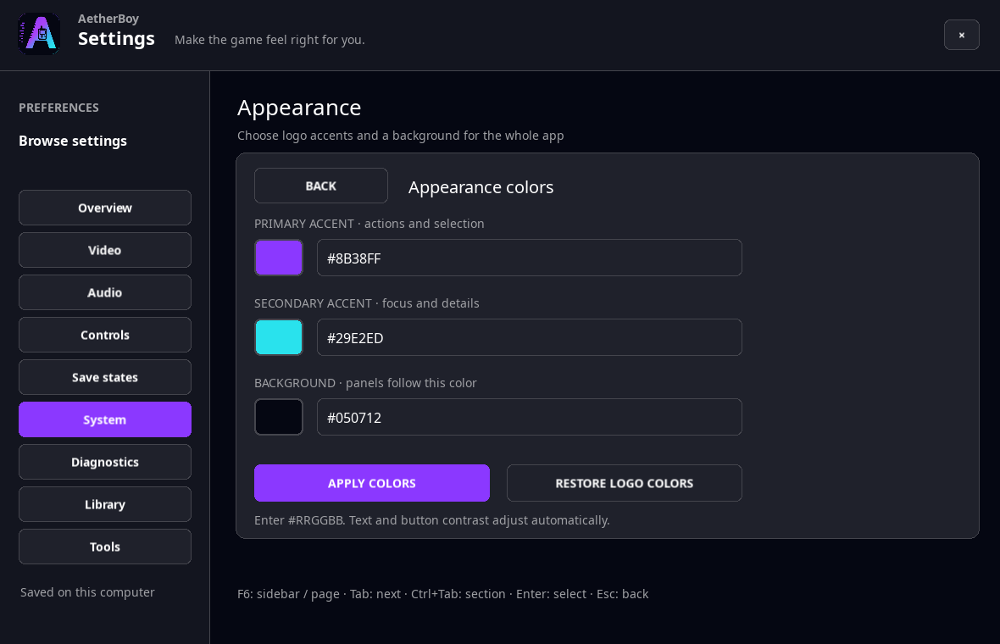

<p align="center">
  
</p>

<h1 align="center">AetherBoy</h1>

<p align="center"><strong>by NekoZDevTeam</strong></p>

## Entwicklungsstand — 8. Oktober 2026

Windows und Linux haben jetzt eine **e-Reader-Kartenbibliothek** unter Einstellungen →
Werkzeuge → e-Reader: Kartensätze importieren und benennen, Streifen ergänzen,
getrennte Spielstände und Fortsetzen mit Vorschaubild. Eigene e-Reader-Firmware
und Kartendateien werden weiterhin benötigt; nichts davon wird mitgeliefert.
Noch kein Firmware-Ersatz und kein automatischer Import einer ganzen Sammlung.
[Bedienung, Tests und Forschungsplan](docs/WINDOWS_ROADMAP.md#e-reader-kartenbibliothek-und-firmware-forschung--08102026).

Scanner und Dotcode-Verarbeitung sind eine MPL-2.0-Adaption aus mGBA;
Bibliothek und Oberflächenanbindung sind AetherBoy-Code. Echte NES-e-Tests halfen,
Fehler bei ARM-Statusregisterzugriffen und Sound-FIFO-DMA im gemeinsamen GBA-Kern
zu beheben. Barcode Boy hat zusätzliche Battle-Space-Regressionen. Eingefügte
Cheats erhalten eine zeilenweise Prüfung und bessere Formaterkennung; mehrdeutige
Formate und offene Platzhalter verlangen eine Auswahl beziehungsweise Korrektur.
Ein erkannter Code garantiert keine passende Spielwirkung.
[Cheat-Unterstützung und bekannte Grenzen](docs/CHEAT_SUPPORT.md).

Der Linux-Beitrag `641cab0` ist enthalten: vollständiger Local-Link-Speicherabschluss,
erhaltene Abschlussfehler, Korrektur eines zu frühen Discord-READY-Ereignisses und
aufbewahrte Linux-CI-Diagnosen. Hardware, WAN-Tausch und allgemeine Spielkompatibilität
bleiben getrennte Abnahmen. [Herkunft und Lizenzen](THIRD_PARTY_NOTICES.md).

### Vorherige Desktop-Stabilisierung

Beide Oberflächen bieten inzwischen Deutsch/Englisch als Anzeigesprache, sechs
Themes mit eigenen Farben, den controllerorientierten Sofa-Modus, AVI-Aufnahmen,
ZIP-/7z-Import und erweiterte Sitzungs-Cheats. Windows verwendet die gemeinsamen
eigenen Aether-Bedienelemente; Linux behält seine native Wayland-Oberfläche.
Implementierung ist keine pauschale Hardware- oder Spielkompatibilitätsfreigabe.

Die jüngste Stabilisierung reduziert unnötiges Neuschreiben älterer Save-Backups,
ergänzt datensparsame Speicherphasen-Diagnose und ersetzt blockierende Windows-
Hintergrundfehlerdialoge durch einen dauerhaften Hinweis mit Wiederholfunktion.
Acht vollständige Runtime-Lastläufe bestanden ohne erneuten GBA-Shutdown-Timeout.
Reale Hardware- und Langzeitabnahmen bleiben offen.
[Änderungen, genaue Testergebnisse und Grenzen (DE/EN)](docs/STABILIZATION_2026-10-02.md).

In den Einstellungen nach **Sprache** suchen: Deutsch, Englisch oder Systemsprache,
wirksam nach Neustart. Deutsche Systemsprachen einschließlich Deutschland,
Österreich und Schweiz wählen automatisch Deutsch; sonst Englisch. Die Sprache
der Spiele wird dadurch nicht verändert.

Aktuelle Pläne: [Windows](docs/WINDOWS_ROADMAP.md) · [Linux](docs/LINUX_ROADMAP.md).

### Gemeinsame Funktionen und Entwicklungsdokumentation

Windows ↔ Linux: gemeinsame Turbo-Audio-/Screenshot-/Performance-Grundlage und
eigene Windows-Menüs. [Umgesetzt, geprüft und noch offen: Funktionsabgleich (DE/EN)](docs/PLATFORM_PARITY.md).
Die Plattformpläne unterscheiden implementierte Werkzeuge von offenen Hardware- und Spieltests.

Neu unter Windows: Firmware Station für eigene Boot-ROMs/BIOS und steuerbare,
begrenzte lokale Diagnose. [Bedienung, Datenschutz und Übergabe (DE/EN)](docs/WINDOWS_FIRMWARE_DIAGNOSTICS.md).

Experimentelles Local Link Lab unter Windows und Linux: zwei GB-/GBC- oder zwei GBA-Spielinstanzen in einer
gemeinsamen lokalen Sitzung, mit getrennten Spielständen. Dieses Lab bleibt lokal;
echte Spiele müssen noch qualifiziert werden. Die native Linux-Zwei-Spieler-Oberfläche ist implementiert.
[Anleitung, Grenzen und Linux-Übergabe (DE/EN)](docs/LOCAL_LINK_LAB.md).
[GBA-Kabel-/CPU-Ausbau](docs/GBA_LOCAL_LINK_HANDOFF.md) ·
[Neuester Linux-Beitrag und Integrationsprüfung](docs/LINUX_UPSTREAM_INTEGRATION_REVIEW.md).

Neu als separater **GB/GBC-Online-Link-Prototyp** für Windows und Linux: ein eigenes
Spiel je Rechner und private Sitzungsspielstände. Native Raumcodes nutzen einen
eingerichteten privaten Raumdienst; manuelle WebRTC-Browserkopplung bleibt verfügbar.
Noch kein bestätigter Pokémon-Tausch;
Internet-Verbindungen können STUN/TURN-Konfiguration benötigen.
[Anleitung, Schutzmaßnahmen und Grenzen (DE/EN)](docs/ONLINE_LINK_HANDOFF.md).
[Erster Windows↔Linux-Test über zwei Internetanschlüsse](docs/ONLINE_PLAYTEST_DE.md).

Neu: **GBA-Pokémon-Gen3-Onlineprofil für Entwicklungstests** über denselben
Windows-/Linux-Transport mit eigener Spielprotokoll-Anbindung. Nur exakt erkannte
Originalfassungen und ausdrückliche Entwicklungsfreigabe; kein geprüfter Tauschrelease
oder universelles GBA-Internetkabel. Beide Oberflächen können protokollierte
Sitzungskopien prüfen und einen sauber beendeten Stand bewusst mit Sicherung übernehmen.
[GBA-Anleitung, Spielstandschutz und offene Abnahme (DE/EN)](docs/GBA_ONLINE_HANDOFF.md).

Windows-Entwicklungsupdate: Stereo/WASAPI, GPU-Ausgabe, State-Galerie und Fortsetzen,
Controller-Quick-Deck, Spielprofile und IPS-/BPS-/UPS-Patch Lab.
[Änderungen, Bedienung und Übergabe an die Linux-Entwicklung (DE/EN)](docs/WINDOWS_DEVELOPMENT_HANDOFF.md#deutsch).

Linux-Nachtrag: zentrale Saves, Stereo, State-Galerie/Fortsetzen/Undo, Spielprofile,
Favoriten/Spielzeit, Controller-Profile und Patch Lab. Neue Texteingabe, optionale
GTK-Zugänglichkeit und abbrechbares Laden ergänzen den nativen Client.
[Linux-Übergabe an die Windows-Entwicklung und den nächsten ChatGPT](docs/LINUX_DEVELOPMENT_HANDOFF.md).

<p align="center">
  <a href="README.md" lang="en">English</a> · <strong lang="de">Deutsch</strong>
</p>

<p align="center">
  <strong>Drei Handhelds. Eine Oberfläche.</strong><br>
  Game Boy · Game Boy Color · Game Boy Advance<br>
  Ein Emulator in C# für Windows und natives Linux / Wayland.
</p>

<p align="center">
  <a href="CHANGELOG.md"></a>
  <a href=".github/workflows/ci.yml"></a>
  <a href="global.json"></a>
  <a href="docs/LINUX_WAYLAND.md"></a>
  <a href="LICENSE"></a>
</p>

<p align="center">
  <a href="#linux-build">Linux-Build</a> ·
  <a href="#windows-build">Windows-Build</a> ·
  <a href="#steuerung-unter-linux">Steuerung</a> ·
  <a href="COMPATIBILITY.md">Kompatibilität</a> ·
  <a href="#dokumentation">Dokumentation</a> ·
  <a href="https://github.com/VoltexModz/AetherBoy/issues">Issues</a>
</p>

> [!IMPORTANT]
> **AetherBoy ist eine Alpha-Version.** GB und GBC besitzen breite automatisierte Testabdeckung. GBA und das Linux-Frontend sind experimentell und benötigen weitere Spiel-, Audio- und Langzeittests. Ein erfolgreicher ROM-Start ist noch kein Nachweis vollständiger Spielbarkeit.

## Ein Blick auf AetherBoy

Die Desktop-Oberfläche stellt das Spiel in den Mittelpunkt: **Spiel öffnen**, Pause, Speichern, Laden und Zurückspulen sind direkt erreichbar. Das gemeinsame Aether-Design nutzt schräg abgeschnittene Bedienelemente und Violett/Cyan als Standard-Akzente, mit dunklen und hellen Themes. Weitere Optionen liegen in den Einstellungen.

Unter Darstellung stehen sechs Theme-Vorgaben sowie frei wählbare Akzent- und Hintergrundfarben bereit. Diese globalen UI-Farben bleiben von den Farbpaletten der Spiele getrennt.

<p align="center">
  
  <br>
  <sub>Frühere native Linux-Ansicht ohne geladene ROM. Aktuelle Builds enthalten zusätzlich das erneuerte Aether-Design und die Sprachauswahl.</sub>
</p>

<details>
<summary><strong>Einstellungen ansehen</strong></summary>

<p align="center">
  
</p>

Neun Bereiche bündeln Übersicht, Video, Audio, Steuerung, Spielstände, System, Diagnose, Bibliothek und Werkzeuge. Die Aufnahme zeigt die Video-Einstellungen des Linux-Clients.

</details>

<details>
<summary><strong>Oberflächenfarben anpassen</strong></summary>

<p align="center">
  
</p>

</details>

## Was AetherBoy mitbringt

| Bereich | Funktionen |
| --- | --- |
| **Drei Systeme** | `.gb`, `.gbc` und experimentell `.gba` im selben Frontend; GBA mit optionalem BIOS und eingebautem HLE-Fallback. |
| **Bild und Audio** | Sharp, Smooth und LCD Grid, DMG-Paletten, Frameskip und Audioausgabe; GBA mit PSG und Direct Sound. |
| **Spielsteuerung** | Tastatur und Gamepad, Pause, Turbo, Vollbild und ROM-Drag-and-drop. |
| **Speichern und Zurückspulen** | Batterie-Spielstände, fünf Save-State-Slots und Rewind für GB, GBC und GBA. |
| **Save-Schutz** | Atomare `.sav`-Schreibvorgänge, Integritätsprüfung und drei rotierende Backups. |
| **Lokale Einstellungen** | Persistente Display-, Audio- und Eingabeoptionen im Control Center. |
| **Bibliothek und Sofa-Modus** | Favoriten, Tags, Bewertungen, Spielzeit und controllerorientierte Vollbildnavigation. |
| **Aufnahmen und Archive** | Screenshots, WAV-Audio, Einzelspiel-AVI mit Ton sowie ZIP-/7z-ROM-Import mit Spielauswahl. |
| **Patches** | IPS/BPS/UPS mit ausdrücklichem Patchen und Starten; Ergebnisse bleiben separat gespeicherte ROMs. Keine automatische Anwendung benachbarter Patches. |
| **Sitzungs-Cheats** | Gemeinsame GB-/GBC-/GBA-Decoder; [Formate und Grenzen](docs/CHEAT_SUPPORT.md). |
| **Anpassung** | Deutsch/Englisch, sechs Themes, eigene Farben, einstellbares Spielstart-Intro und optionale Discord-Aktivität. |
| **Portabler Speicher** | `--portable` oder `aetherboy.portable` speichert beim Programm; keine automatische Profilübernahme. |
| **Barcode Boy** | Gemeinsame Zubehör-Implementierung und manuelle Barcode-Eingabe; Prüfung mit unterstütztem Spiel noch offen. |

### Windows und Linux im Vergleich

Beide Frontends verwenden denselben plattformneutralen Core und dieselbe Runtime. Entsprechende Werkzeuge sind implementiert; Plattformintegration und Abnahme auf echten Geräten bleiben getrennt:

| | Windows | Linux |
| --- | --- | --- |
| **Frontend** | Windows Forms | SDL3, natives Wayland |
| **Aether-Oberfläche und Control Center** | Vorhanden | Vorhanden, an Kachel- und Breitbildfenster angepasst |
| **ROM öffnen** | Dateidialog und Drag-and-drop | XDG Desktop Portal, Dateipfad und Drag-and-drop |
| **Tastatur / Gamepad** | Beide, mit Belegungseinstellungen | Beide frei belegbar; Controller-Profile und Deadzone |
| **Batterie-Saves, fünf State-Slots, Rewind** | Vorhanden | Vorhanden |
| **Cartridge Vault, Cheat-Verwaltung, Save Safety Center** | Vorhanden, teils experimentell | Linux-Bibliothek, Sitzungs-Cheats und Backup-Wiederherstellung vorhanden |
| **WAV-Aufnahme und Boot-ROM-Auswahl** | Vorhanden | Unter Tools / System vorhanden |
| **State-Galerie/Fortsetzen und Spielprofile** | Vorhanden | Jetzt vorhanden, einschließlich Lade-Undo und globaler Profilvererbung |
| **Native Screenshots / Performance** | Gemeinsame Runtime-Dienste | F12 / F9 und Tools; native Bedienprobe für den vereinten Stand noch offen |
| **Schnellmenü / Audio Inspector** | Vorhanden | In der nativen Oberfläche vorhanden |
| **IPS-/BPS-/UPS-Patch Lab** | Integriert; UPS-Rückpatchen ausdrücklich wählbar | Unter Library → Patch Lab; ausdrückliches UPS-Rückpatchen |
| **Stereo-Ausgabe** | GB/GBC/GBA durchgängig | GB/GBC/GBA durchgängig |
| **Lokales GB/GBC/GBA-Link-Kabel** | Experimentelles Zwei-Spieler-Lab | Native Zwei-Spieler-Oberfläche; dieselbe Runtime und Hardwarefamilien-Grenzen |
| **Sprache / Themes / Sofa / AVI / Archive** | Implementiert | Implementiert; weitere native Desktop-Abnahme erforderlich |

Die genaue Zuordnung steht in [Windows → Linux: UI-Stand](docs/LINUX_UI_PARITY.md).

## Linux-Build

**Neu: ein eigener nativer Linux-Client mit SDL3 und Wayland**, einschließlich Hyprland-Profil, Audio, Gamepads, Control Center und Installation ins App-Menü. Die Build-Skripte erkennen **x86-64** und **ARM64** automatisch.

### Voraussetzungen

- Linux mit einer **nativen Wayland-Sitzung** und funktionierendem Grafiktreiber.
- **.NET SDK 10.0.302** oder ein neuerer Patch derselben `10.0.3xx`-Feature-Band, entsprechend [`global.json`](global.json).
- Die üblichen .NET-Systembibliotheken einschließlich ICU sowie PipeWire-, PulseAudio- oder ALSA-Clientbibliotheken für Audio.
- Ein passendes **XDG Desktop Portal** für den Dateidialog. Unter Hyprland: `xdg-desktop-portal-hyprland` plus GTK- oder KDE-Portal für die Dateiauswahl.

SDL3, Logo und Schriften werden über das Projekt mitgeliefert. Der Linux-Client setzt natives Wayland voraus; **X11 und XWayland werden nicht unterstützt**. Hyprland, KDE Plasma und GNOME werden separat erkannt.

### Bauen und starten

Der aktuelle Entwicklungsstand liegt auf dem Branch `development`:

```bash
git clone --branch development https://github.com/VoltexModz/AetherBoy.git
cd AetherBoy
bash scripts/build-linux.sh
bash scripts/run-linux.sh
```

Danach eine `.gb`-, `.gbc`- oder `.gba`-Datei über **Spiel öffnen**, die Taste **O** oder Drag-and-drop öffnen. ZIP-/7z-Archive werden unterstützt; bei mehreren Spielen erscheint eine Auswahl. Importierte Spiele bleiben als separate ROMs gespeichert. Eine ROM lässt sich auch direkt übergeben:

```bash
bash scripts/run-linux.sh "/pfad/zu/deinem-spiel.gba"
```

| Architektur | Build-Ausgabe |
| --- | --- |
| x86-64 | `artifacts/AetherBoy-linux-x64/` |
| ARM64 | `artifacts/AetherBoy-linux-arm64/` |

Der Build benötigt auch beim Ausführen eine installierte **.NET-10-Runtime**; sie wird nicht in die Ausgabe eingebettet. Das SDK bringt die Runtime bereits mit. `run-linux.sh` baut automatisch neu, wenn der Build fehlt oder älter als die Quelldateien ist.

### Im App-Menü installieren

Nach dem Build kann AetherBoy ohne Root-Rechte für den aktuellen Benutzer installiert werden:

```bash
bash scripts/install-linux-user.sh
aetherboy "/pfad/zu/deinem-spiel.gbc"
```

Die Programmdateien liegen standardmäßig unter `~/.local/share/aetherboy/program`, der Starter unter `~/.local/bin/aetherboy`. Das Skript installiert außerdem den Desktop-Eintrag und die Icons. Für den Terminalaufruf muss `~/.local/bin` im `PATH` liegen. Der installierte Starter kennt auch den beim Installieren erkannten Runtime-Pfad. Updates bereiten einen neuen Release-Ordner vor dem Umschalten vor.

<details>
<summary><strong>Wayland prüfen und Startprobleme eingrenzen</strong></summary>

```bash
echo "$XDG_SESSION_TYPE"
echo "$WAYLAND_DISPLAY"
dotnet --version
```

`WAYLAND_DISPLAY` muss gesetzt sein; eine als `x11` gemeldete Sitzung wird abgelehnt.

Desktop-Erkennung ohne Fenster prüfen:

```bash
dotnet run --project frontends/AetherBoy.Desktop/AetherBoy.Desktop.csproj -- --platform-info
```

Wayland und das Standard-Audiogerät gemeinsam prüfen:

```bash
bash scripts/run-linux.sh --audio-info
```

Falls unter Hyprland kein Dateidialog erscheint, die [Portal-Konfiguration](docs/LINUX_WAYLAND.md#hyprland-profil) prüfen. Weitere Hilfe gibt es im [Linux User Guide](docs/LINUX_USER_GUIDE.md#7-troubleshooting).

</details>

**Weiterlesen:** [Linux / Wayland / Hyprland (Deutsch)](docs/LINUX_WAYLAND.md) · [Linux User Guide (English)](docs/LINUX_USER_GUIDE.md)

## Windows-Build

Benötigt werden Windows und dasselbe **.NET SDK 10.0.302** beziehungsweise ein neuerer Patch der `10.0.3xx`-Feature-Band. Audio benötigt ein funktionierendes Windows-Ausgabegerät; WASAPI und WinMM stehen zur Verfügung.

Im Repository-Verzeichnis mit PowerShell ausführen:

```powershell
dotnet restore ./nanoboy.sln --locked-mode --configfile ./NuGet.config
dotnet build ./nanoboy.sln -c Release --no-restore
dotnet run --project ./nanoboy/nanoboy.csproj -c Release --no-build
```

### Windows: lokale Daten und Entwicklungsdiagnose

Die normale Anwendung ist standardmäßig ein Development-Build, auch bei
`-c Release`. Sie zeichnet lokale Sitzungsberichte automatisch auf. Es gibt
keine separate Tester-Anwendung und keinen erforderlichen Startschalter.
Der Buildkanal steht in der EXE; Git wird auf dem Rechner des Spielers nicht benötigt.
Für spätere stabile Veröffentlichungen kann beim Bauen/Publishen
`-p:AetherBoyChannel=stable` gesetzt werden; dann ist die Sitzungsaufzeichnung
standardmäßig aus. `--tester-mode` bleibt als optionaler Diagnoseschalter kompatibel.

Alle verwalteten Windows-Daten liegen unter `%LOCALAPPDATA%\AetherBoy`:

| Unterordner | Inhalt |
| --- | --- |
| `Roms/<SHA-256>/` | Lokale Kopie jeder geöffneten ROM, mit lesbarem Dateinamen |
| `Saves/<SHA-256>/` | `game.sav`, RTC, Integritätsdateien und rotierende Backups |
| `States/<SHA-256>/` | `game.ss1`–`game.ss5`, `game.resume`, Vorschauen und vorherige States als Backup |
| `Settings/` | `settings.json`, Sicherung, ROM-Verlauf und `Profiles/<SHA-256>.json` |
| `Library/` | Titel, Favoriten, Spielzeit und Vorschaumetadaten je ROM |
| `Screenshots/<SHA-256>/` | Manuell aufgenommene Spielbild-PNGs in nativer Auflösung |
| `Firmware/` | Optional selbst bereitgestellte Boot-ROMs/BIOS |
| `Recordings/` | Audio- und Gameplay-Aufnahmen |
| `development/Sessions/` | Diagnoseberichte pro Programmstart |
| `development/Crashes/` | Crashlogs der Development-Builds |

Die ROM-Bibliothek bietet **ROM-Ordner öffnen**, das **Control Center → Ordner**
zusätzlich Zugriff auf die übrigen Daten. Beim Öffnen einer externen ROM wird sie
kopiert; das Original bleibt erhalten. Gleiche Inhalte werden wiederverwendet,
unterschiedliche ROM-Hacks erhalten getrennte Saves. Auch ältere importierte
Spiele bleiben in der Bibliothek auffindbar, unabhängig vom begrenzten Verlauf.

Beim ersten Import werden vorhandene ROM-nahe `.sav`-, RTC-, Backup-, Guard- und
`.ss1`–`.ss5`-Dateien mit übernommen. Bereits vorhandene zentrale Save-/State-Ordner
haben Vorrang; ein erneuter Import überschreibt sie nicht. Alte Dateien werden
nicht gelöscht. Einstellungen werden beim ersten Zugriff aus dem bisherigen
WinForms-Speicherort übernommen. Beschädigte zentrale Einstellungen können aus
der letzten lesbaren Sicherung geladen werden. Stabile Builds speichern Crashlogs
unter `Crashes/`; vorhandene ältere `Logs/` und `TesterSessions/` bleiben erhalten.

Diagnoseberichte enthalten Buildidentität, ROM-Header/Hash, Frame-Fortschritt,
Controllerwechsel und Save-State-/Rewind-Ergebnisse. Sie enthalten keine ROM-Dateien,
ROM-Pfade oder Save-Inhalte. Es gibt keinen Upload. Unter **Diagnostics** kann der
aktive Bericht manuell als ZIP exportiert werden. Ein fortschreitender Framezähler
beweist noch keine korrekte Spielgrafik und ersetzt keinen Spieltest.

Für die Weitergabe per USB den vollständigen Publish-Ordner kopieren. Die EXE
und ihre Abhängigkeiten gehören zusammen; persönliche Spieldaten bleiben auf
dem jeweiligen Rechner. [`--portable` oder die Markerdatei](docs/PORTABLE_MODE.md)
speichert neue Daten stattdessen beim Programm; vorhandene Profile werden nicht
automatisch übernommen. Der weitere Ausbau steht im [Windows-Plan](docs/WINDOWS_ROADMAP.md).

Die historischen Datei- und Ordnernamen `nanoboy` bleiben im Quellbaum erhalten; das Produkt heißt **AetherBoy**.

## Steuerung unter Linux

Die wichtigsten Standardbelegungen; Spieltasten lassen sich unter **Control Center → Input** ändern.

| Aktion | Tastatur | Gamepad |
| --- | --- | --- |
| Steuerkreuz | Pfeiltasten | D-Pad oder linker Stick |
| A / B | Z / X auf US-Layouts, **Y / X auf deutschen Layouts** | Untere / rechte Aktionstaste |
| Start / Select | Enter / Rücktaste | Start / Back |
| GBA L / R | Q / E | Linke / rechte Schultertaste |
| ROM öffnen / Control Center | O / C | — |
| Pause / Turbo halten | Leertaste / Tab | — |
| Save-State-Slot auswählen | 1–5 | — |
| Schnellspeichern / Schnellladen | F5 / F8 | — |
| Einen Rewind-Schritt zurück | F7 | — |
| Vollbild | F11 | — |
| Einstellungen schließen / Vollbild verlassen | Escape | — |

Die A/B-Vorgaben beziehen sich auf die physischen Tastenpositionen. AetherBoy zeigt die Belegung passend zum aktuellen Tastaturlayout an. Alle Shortcuts und die Tastaturnavigation stehen im [Linux User Guide](docs/LINUX_USER_GUIDE.md#5-controls).

Prioritäten, unabhängige Kritik und reproduzierbare Tests: [Linux-Roadmap](docs/LINUX_ROADMAP.md), [Kritik Runde 3](docs/LINUX_CRITIQUE_ROUND3.md), [Playtest Runde 3](docs/LINUX_PLAYTEST_ROUND3.md), [Fixliste](docs/LINUX_FIX_LOG.md). Pakete mit eingebetteter .NET-Runtime: [Linux-Distribution](docs/LINUX_DISTRIBUTION.md). Das optionale zugängliche Control Center öffnet mit Ctrl+F7; F7 bleibt Rewind.

## Spielstände und BIOS

- **Batterie-Spielstände:** Unter Windows zentral in `AetherBoy\Saves`; unter Linux in `$XDG_DATA_HOME/aetherboy/saves/<ROM-SHA256>`. `.bak1` bis `.bak3` und `.guard`-Dateien schützen die Spielstände. Nur das jeweilige Save-Verzeichnis muss beschreibbar sein.
- **Save States:** fünf Slots von `.ss1` bis `.ss5`, gebunden an die exakte ROM, das Hardwaremodell und gegebenenfalls das BIOS. Inkompatible Zustandsversionen werden abgelehnt; eine automatische Migration älterer Schemata ist noch nicht vorhanden.
- **Rewind:** ein sitzungsgebundener Puffer mit bis zu etwa zehn Sekunden Historie; für GBA zusätzlich durch ein Speicherbudget begrenzt.
- **Linux-Einstellungen:** unter `$XDG_CONFIG_HOME/aetherboy/settings.json`, normalerweise `~/.config/aetherboy/settings.json`.
- **GBA-BIOS:** ohne eigene Firmware greift der eingebaute HLE-Fallback. Der Kern unterstützt optional ein exakt 16 KiB großes `gba_bios.bin`; der Import erfolgt unter **Settings → System → Import boot ROM / BIOS**.

ROMs und Boot-ROMs werden nicht mitgeliefert und sind zum Bauen nicht erforderlich.

Neue GB/GBC-States enthalten Stereo-Audiohistorie: Neue Builds lesen alte Mono-States,
ältere Builds jedoch nicht die neue Erweiterung. Batterie-Saves und GBA-State-Formate
bleiben in diesem Update unverändert. [Kompatibilitätsdetails](docs/WINDOWS_DEVELOPMENT_HANDOFF.md#deutsch).

## Kompatibilität und offene Arbeit

**GB / GBC:** MBC1, MBC1M, MBC2, MBC3 mit RTC und MBC5 sind implementiert. Die ausgewählten Blargg-Soundsuiten bestehen laut dokumentierter Matrix auf DMG und CGB jeweils 12/12 Tests. Das ersetzt keinen Durchspieltest und ist keine pauschale Kompatibilitätsquote. Spezialmapper wie MMM01, MBC4, Pocket Camera und HuC1/HuC3 werden abgelehnt; exakte Pixel-FIFO- und einzelne Timing-Effekte bleiben offen.

**GBA:** Ein vendorter, MIT-lizenzierter [GBADotnet-Kern](third_party/GBADotnet.Core/README.md) ist an Bild, Eingabe, Audio, SRAM/Flash/EEPROM/RTC, Save States und Rewind angebunden. Vollständig zyklusgenaues Timing, weitere Renderer-Grenzfälle und breitere Praxistests stehen noch aus.

**Sitzungs-Cheats:** Die [Support-Matrix](docs/CHEAT_SUPPORT.md) beschreibt GB-/GBC-GameShark-`01`-Schreibcodes, CodeBreaker, Rohadressen und Game Genie mit sechs/neun Zeichen. GBA unterstützt CodeBreaker-Masterstreams, GameShark v1/v2 und Action Replay v3 samt Bedingungen, Füllbefehlen, Hooks, indirekten Schreibzugriffen und reversiblen ROM-Änderungen im Speicher. Beide Oberflächen verwenden dieselben Decoder, Formatwahl und virtuelle Gerätetaste. Sets werden nicht dauerhaft gespeichert; passende Spielversion und erforderliche Mastercodes liegen beim Nutzer. Einzelne Spezialbefehle und GB-Bankwechselvarianten fehlen weiterhin. Erfolgreiches Einlesen beweist keine korrekte Wirkung im Spiel.

**Weitere Grenzen:** Das experimentelle [Local Link Lab für GB/GBC/GBA](docs/LOCAL_LINK_LAB.md) unter Windows/Linux ist noch nicht mit kommerziellen Spielen validiert. Separate [GB/GBC-Online-Link](docs/ONLINE_LINK_HANDOFF.md)- und [GBA-Pokémon-Gen3-Onlineprofile](docs/GBA_ONLINE_HANDOFF.md) sind Entwicklungstests, kein bestätigter Pokémon-Tauschrelease. Universelles GBA-Netzwerk, GBA-Wireless, Joybus und Vier-Spieler-Link fehlen; GBA lässt sich nicht mit GB/GBC koppeln. Der Debugger bleibt experimentell.

Details und reproduzierbare Ergebnisse: [Kompatibilitätsmatrix](COMPATIBILITY.md) · [GBA-Status](GBA.md) · [Projektstatus](docs/PROJECT_STATUS_DE.md).

## Entwicklung und Tests

Die Lösung trennt **Core**, **Runtime** und **Desktop-Frontends**. Der Emulationszustand gehört einem dedizierten Owner-Thread; die Oberflächen kommunizieren über typisierte Befehle und unveränderliche Snapshots. NuGet-Lockfiles und das gepinnte SDK halten den Build reproduzierbar.

Die [GitHub-Actions-CI](.github/workflows/ci.yml) baut und testet die Lösung auf Windows sowie Core, Runtime und den nativen Desktop-Host auf Linux. Pushes auf `main` und `development` werden geprüft; der Workflow sichert Mindest-Testzahlen ab. Die Linux-CI prüft Frontend-Logik und Plattform-Erkennung, anschließend native UI und Zugänglichkeit in isoliertem Weston/D-Bus. Echte Hardware- und Spieltests bleiben getrennte Abnahmen.

<details>
<summary><strong>Testbefehle und Entwicklungswerkzeuge</strong></summary>

Gesamte Lösung auf Windows testen, nach dem oben beschriebenen Build:

```powershell
dotnet test --solution ./nanoboy.sln -c Release --no-build --no-restore
```

Plattformneutrale Tests und Linux-Frontend-Tests:

```bash
dotnet test --project tests/AetherBoy.CoreTests/AetherBoy.CoreTests.csproj -c Release
dotnet test --project tests/AetherBoy.RuntimeTests/AetherBoy.RuntimeTests.csproj -c Release
dotnet test --project tests/AetherBoy.DesktopTests/AetherBoy.DesktopTests.csproj -c Release
```

Zusätzlicher nativer UI-Test innerhalb einer Wayland-Sitzung:

```bash
AETHERBOY_UI_TESTS=1 dotnet test --project tests/AetherBoy.DesktopTests
```

Eigene lokale GB-/GBC-Conformance-ROMs ausführen:

```bash
dotnet run --project tools/AetherBoy.Conformance/AetherBoy.Conformance.csproj -c Release -- \
  "/pfad/zur/testsuite" --max-frames 600 --json ./artifacts/conformance.json
```

Die CLI unterstützt einzelne ROMs, Verzeichnisse und ein [JSON-Manifest](tools/AetherBoy.Conformance/compatibility.example.json). Test-ROMs sind nicht enthalten. Exitcode `0` bedeutet bestandene Pflichtläufe, `1` einen blockierenden Fehler oder Timeout und `2` einen Aufruffehler.

Den separaten ARM/Thumb/Mode-3-Prototyp mit einem generierten Testprogramm prüfen:

```bash
dotnet run --project tools/AetherBoy.GbaProbe/AetherBoy.GbaProbe.csproj -c Release
```

Dieser Lern- und Regressionpfad schreibt `artifacts/gba-prototype.bmp`. Er ist vom GBADotnet-Kern der normalen Anwendung unabhängig; mGBA dient ausschließlich als Referenz.

</details>

## Dokumentation

| Thema | Einstieg |
| --- | --- |
| Neueste Stabilisierung und Prüfgrenzen | [Speicherabschluss, Fehlerbehandlung und Sprache (DE/EN)](docs/STABILIZATION_2026-10-02.md) |
| Aktuelles Windows-Entwicklungspaket | [DE/EN-Übergabe, gemeinsame Schnittstellen, Tests und nächste Schritte](docs/WINDOWS_DEVELOPMENT_HANDOFF.md) |
| Projektstand und nächste Schritte | [Deutsch](docs/PROJECT_STATUS_DE.md) · [English](docs/PROJECT_STATUS_EN.md) |
| Linux einrichten und bedienen | [Wayland / Hyprland (DE)](docs/LINUX_WAYLAND.md) · [User Guide (EN)](docs/LINUX_USER_GUIDE.md) |
| Windows- und Linux-Oberfläche | [UI-Zuordnung und offene Funktionen](docs/LINUX_UI_PARITY.md) |
| Emulationskompatibilität | [Testmatrix](COMPATIBILITY.md) · [GBA-Status](GBA.md) |
| GBA-Technik und Herkunft | [Architektur](docs/GBA_CORE_ARCHITECTURE.md) · [GBADotnet-Review](docs/GBADOTNET_REVIEW.md) |
| Änderungen und Abhängigkeiten | [Changelog](CHANGELOG.md) · [Drittanbieterhinweise](THIRD_PARTY_NOTICES.md) |

Fehler gefunden? Ein [Issue](https://github.com/VoltexModz/AetherBoy/issues) mit Version, Betriebssystem, unter Linux auch Desktop/Compositor, Reproduktionsschritten und erwarteter Ausgabe hilft bei der Eingrenzung. Keine ROMs, BIOS-Dateien oder persönlichen Spielstände hochladen.

## Lizenz und Herkunft

**NekoZDevTeam** entwickelt und pflegt AetherBoy für Windows und Linux.
Mit diesem gemeinsamen Projekt lassen wir unseren früheren Teamnamen wieder aufleben.

AetherBoy begann 2014 als **nanoboy** von **Frédéric Meyer**, wurde als **ChiiBoy Color** weitergeführt und wird heute von NekoZDevTeam unter dem Namen AetherBoy modernisiert. Urheberschaft und Copyright verbleiben bei den ursprünglichen Autoren und späteren Beitragenden.

Der Emulatorcode steht unter **GPL-3.0-only**; siehe [LICENSE](LICENSE). Drittanbieterkomponenten, insbesondere der MIT-lizenzierte GBADotnet-Kern und die gebündelten Schriften, besitzen eigene Lizenzen: [THIRD_PARTY_NOTICES.md](THIRD_PARTY_NOTICES.md).

Verwende nur ROMs und Firmware, zu deren Nutzung du berechtigt bist. Die Codelizenz gewährt keine Rechte an Spielen oder Nintendo-Firmware. AetherBoy ist nicht mit Nintendo verbunden oder von Nintendo autorisiert; Game Boy, Game Boy Color und Game Boy Advance sind Marken ihrer jeweiligen Rechteinhaber.
